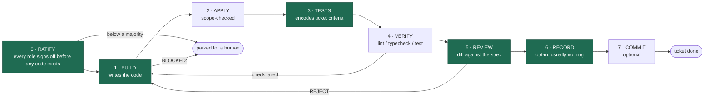
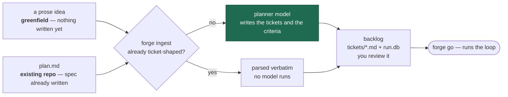
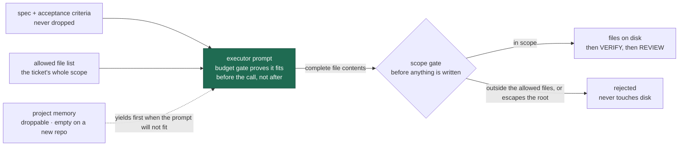

# How a run works

Three diagrams: the loop that runs per ticket, the two ways work gets into it,
and what reaches the executor on a single ticket.

The loop is identical whether the repository is a day old or a decade old. What
changes between those two cases is only what gets fed into it.

---

## One ticket, end to end

The green steps are model calls, each wrapped by the budget gate. The rest are
your own shell commands and `git`, and cost nothing.

RATIFY is the one that can be turned off. It is **on** by default —
`loop.ratifyPasses` is `2` — and puts the ticket to every role before it is
built, so a scope the executor cannot work in, a criterion the tester cannot
assert, or a bar the reviewer will not accept surfaces while changing the ticket
is still free. Set it to `0` on a backlog you have already vetted by hand. See
[RATIFY.md](RATIFY.md).

The pass resolves on the votes it gets: everyone signs is `unanimous`, a
majority is `majority`, the planner plus one other is `split`, and anything less
parks the ticket. A pass where every call failed is `unavailable`, and the
ticket proceeds unratified rather than being parked over an outage.

Verification runs **before** any model reviews, so the reviewer judges a diff
that already compiles and passes — it is never asked to guess whether it would.
That is also why an acceptance criterion saying "the test command exits 0" is
settled by the run rather than by anyone reading it.

APPLY does more than check paths. It refuses an attempt that rewrites a build
manifest and drops dependencies it already declared — the one deletion nothing
downstream can catch, because verification runs where those packages are
already installed and passes either way.

Both retry edges are bounded by `maxAttempts` (default 5). Past that the ticket
parks as failed — and with `retryCycles` at its default of `-1` the whole
backlog is then requeued, respec'd, and run again until a cycle repeats itself
exactly or the backlog comes out clean. A `BLOCKED:` does not retry at all: an underspecified spec does
not improve by being asked again.

---

## Two ways in, one backlog

Greenfield and existing repos do not run different pipelines. They enter the
same one and take different branches through `forge ingest`.

That branch matters more than it looks. A ticket-shaped document is used *as
written*, so the acceptance criteria the executor is judged against stay the
ones their author chose. Send a freeform idea instead and the planner
paraphrases them into its own words first — the right trade for a repo that has
nothing yet, the wrong one for a spec you already sweated over.

---

## What reaches the executor

Retrieved memory is the only droppable part of the prompt. That ordering is what
makes the same ticket safe against a young repo and a crowded one: context
yields, the spec never does — a ticket that only fits after discarding its own
requirements has not been made to fit, it has been made meaningless. A memory
outage degrades the run to *no context* rather than ending it.

---

## What actually differs

| Stage | Greenfield | Existing repo |
|---|---|---|
| Endpoints | Asked once, probed live, saved to the machine profile | Reused from the profile — the second repo is Enter-through |
| Verify commands | Nothing to read, so they stay **blank**. You supply them | Read from CI and docs by the planner, copied verbatim with flags |
| Plan origin | Freeform idea → the planner writes tickets and criteria | Ticket-shaped `plan.md` → parsed verbatim, no model |
| `neverDelegate` | Usually empty — nothing sensitive exists yet | Load-bearing: auth, migrations, crypto, public API surface |
| Memory in | Room is new; retrieval returns nothing | Prior decisions reach the executor *and* the reviewer |
| Memory out | Builds the history later runs will read back | Adds to it — and mostly records nothing, by design |
| Scope gate | Rarely fires; tickets mostly create files | Fires often, and that is the point |
| Review | Judges the diff against the spec alone | Also checks nothing contradicts an established convention |

---

## What never changes

**Triage.** A ticket routed `withheld:<reason>` is left for a human even if that
stalls the backlog. The loop is not entitled to overrule the plan to keep
moving. `forge release` and `forge discharge` are how a person answers one —
from outside the run, without restarting it.

**Authorship.** The executor never writes the criteria it is judged against. A
model that writes both encodes its bugs as passing tests.

**Blocked.** A `BLOCKED:` never retries. Fix the ticket, not the run.

**Waiting.** An exhausted usage window parks the run in `waiting_budget`, a live
state. The dashboard shows when it reopens; the loop wakes itself.

**Durability.** State lives in SQLite, not in a conversation. Kill the process,
fill a context window, reboot the host — `forge go` picks the backlog back up.
